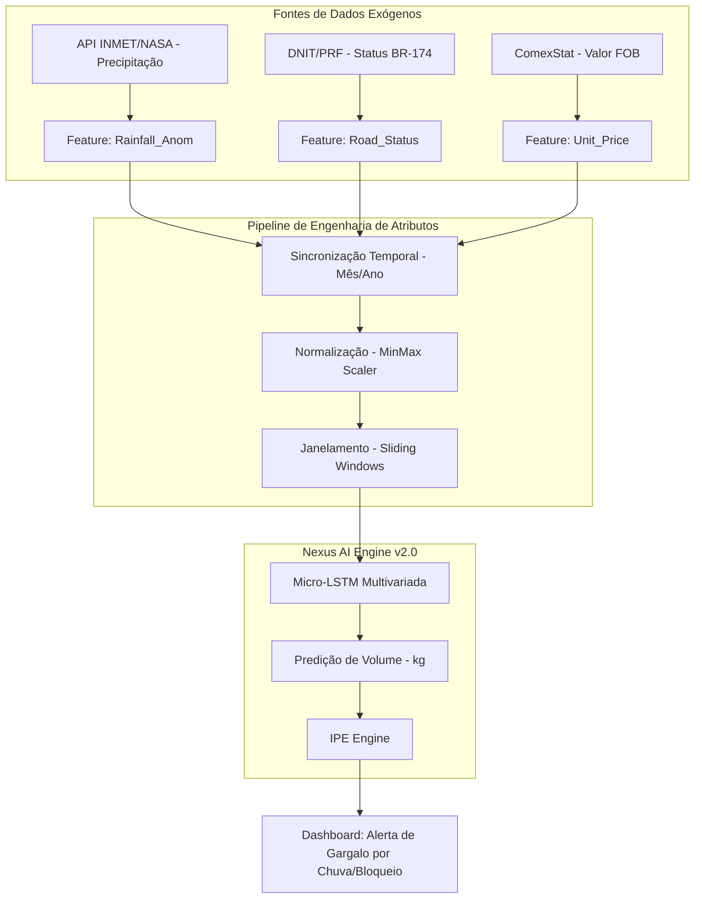

# Proposta Técnica: Fluxo de Dados Multivariado (Exógeno)

Este documento demonstra como as novas fontes de dados serão integradas ao motor LSTM atual na evolução da plataforma.

## 1. Fluxo de Dados e Pipeline



---

## 2. Especificação Técnica da Implementação

Para suportar essas variáveis exógenas, faremos as seguintes alterações estruturais:

### A. Data Schema (Engenharia de Features)
* **`Rainfall_Anom` (Float):** Desvio percentual da média histórica de chuva. Chuva excessiva em Roraima/Mato Grosso impacta diretamente a velocidade de colheita e transporte.
* **`Road_Integrity` (Int 0-3):** Índice de trafegabilidade da BR-174 (0: Bloqueada, 1: Crítica, 2: Regular, 3: Ótima). Dados extraídos via scraping de boletins do DNIT.

### B. Alteração no Modelo (`server/core/train_engine.py`)
Atualmente, o LSTM recebe uma entrada de dimensão 3 `([kg, fob, safra_ativa])`. Com a expansão, a camada de entrada será reconfigurada para dimensão 5:

```python
# Exemplo de reconfiguração da entrada da rede
model.add(LSTM(units=8, input_shape=(n_steps, 5))) # 5 variáveis exógenas
```

### C. Lógica de Inferência (`server/services/predictor_service.py`)
O serviço de predição passará a aceitar um parâmetro de "Cenário de Infraestrutura":
1. **Cenário Otimista:** BR-174 pavimentada e Clima Seco.
2. **Cenário Realista:** Médias históricas.
3. **Cenário de Crise:** Bloqueio na BR-174 + El Niño (Seca extrema ou Chuva excessiva).

---

## 3. Próximos Passos (Sprint Plan)

| Atividade | Descrição | Responsável |
|---|---|---|
| **ETL Exógeno** | Criar script de extração automatizada de dados do INMET para RR e MT. | Backend Specialist |
| **Retreinamento** | Treinar `model_12019000_14_v2.keras` com as novas 5 features. | ML Engineer |
| **UI Update** | Adicionar "Toggle de Condição da Estrada" no `SimulatorPanel`. | Frontend Specialist |
| **Validação** | Comparar o MAE do modelo v1 vs v2 para provar o ganho de acurácia. | Tester |
